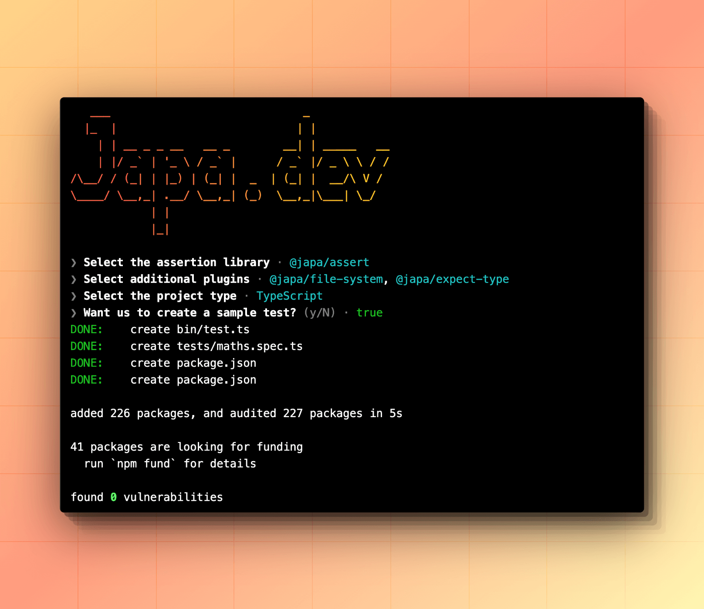

# create-japa
> Setup japa inside an existing Node.js app

[![github-actions-image]][github-actions-url] [![npm-image]][npm-url] [![license-image]][license-url] [![typescript-image]][typescript-url]



The `create-japa` is a small CLI utility to configure Japa inside an existing Node.js project.

The process involves installing the required packages and creating the necessary files. The setup works with Typescript and JavaScript projects.

## Usage
Navigate to the root of your project and run the following command.

```sh
# npm
npm init japa

# yarn
yarn create japa

# pnpm
pnpm create japa
```

## Options

### `destination`

You can pass the destination directory as the first argument to the command. For example:

```sh
npm init japa my-app
```

This will initialize Japa inside the `my-app` directory.

### `--package-manager`

We are trying to detect the package manager used by your project. However, you can always override it by passing the `--package-manager` flag.

```sh
npm init japa -- --package-manager=pnpm
```

Follow the prompts and you will be all set!

[github-actions-image]: https://img.shields.io/github/actions/workflow/status/japa/create-japa/checks.yml?style=for-the-badge
[github-actions-url]: https://github.com/japa/create-japa/actions/workflows/checks.yml "github-actions"

[npm-image]: https://img.shields.io/npm/v/create-japa.svg?style=for-the-badge&logo=npm
[npm-url]: https://npmjs.org/package/create-japa "npm"

[license-image]: https://img.shields.io/npm/l/create-japa?color=blueviolet&style=for-the-badge
[license-url]: LICENSE.md "license"

[typescript-image]: https://img.shields.io/badge/Typescript-294E80.svg?style=for-the-badge&logo=typescript
[typescript-url]:  "typescript"
